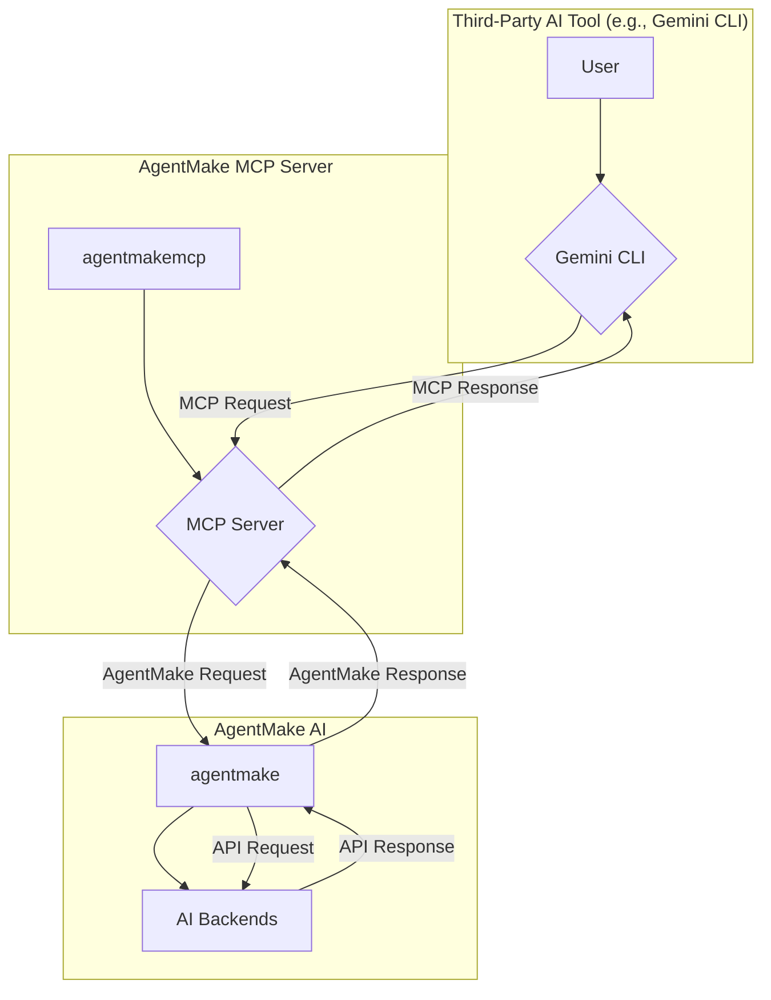

# AgentMake MCP: Your Gateway to Multi-Agent AI Systems

[](https://badge.fury.io/py/agentmakemcp)
[](https://opensource.org/licenses/MIT)

**AgentMake MCP** offers the simplest way to set up Modal Context Protocol (MCP) servers, powering them with the versatile agentic components from the **[AgentMake AI](https://github.com/eliranwong/agentmake)** framework. This project provides the essential tools and infrastructure to create sophisticated multi-agent systems that can tackle complex tasks through collaboration and dynamic task allocation.

While **AgentMake AI** provides the core building blocks for creating individual AI agents, **AgentMake MCP** enables you to assemble and orchestrate them. Think of **AgentMake AI** as the factory for creating your specialized AI workers, and **AgentMake MCP** as the central command center where you manage your teams of agents on large-scale projects.

## Table of Contents

- [AgentMake MCP: Your Gateway to Multi-Agent AI Systems](#agentmake-mcp-your-gateway-to-multi-agent-ai-systems)
  - [Table of Contents](#table-of-contents)
  - [How it Works](#how-it-works)
  - [Key Features](#key-features)
  - [Getting Started](#getting-started)
    - [1. Prerequisites](#1-prerequisites)
    - [2. Installation](#2-installation)
    - [3. Create a Configuration File](#3-create-a-configuration-file)
    - [4. Running the Server](#4-running-the-server)
  - [Usage](#usage)
    - [Integrating with Third-Party AI Tools](#integrating-with-third-party-ai-tools)
  - [Examples](#examples)
  - [Contributing](#contributing)
  - [License](#license)

## How it Works

The following diagram illustrates the relationship between `AgentMake AI`, `AgentMake MCP`, and a third-party AI tool (in this case, `Gemini CLI`):



With AgentMake MCP, you can:

*   **Integrate Diverse AI Tools:** Don't limit yourself to a single AI tool. Seamlessly connect AgentMake AI components with third-party AI tools using the standardized MCP interface.
*   **Orchestrate Multiple Agents:** Define and manage how different AI agents, each with unique skills, collaborate to achieve a common goal.
*   **Build Complex Workflows:** Design intricate workflows where agents delegate tasks, share information, and work in parallel to solve problems more efficiently.
*   **Host Your Own MCP Server:** Easily deploy a dedicated server for your multi-agent systems, allowing for robust integration with your applications and services.

## Key Features

*   **Easy Server Setup:** Quickly deploy a fully functional MCP server with minimal configuration.
*   **Seamless AgentMake AI Integration:** Leverage the full power of AgentMake AI's 16+ AI backends and 7 agentic components.
*   **MCP Standards:** Supports running both MCP tools and MCP prompts with `AgentMake` components.
*   **Flexible Agent Orchestration:** Define custom collaboration strategies and communication protocols for your agents.
*   **Scalable and Extensible:** Designed to support a growing number of agents and complex workflows.
*   **Developer-Friendly:** A clean and intuitive API for defining and managing your multi-agent systems.

## Getting Started

### 1. Prerequisites

*   Python 3.8+
*   Familiarity with the agentic components supported by [AgentMake AI](https://github.com/eliranwong/agentmake).
*   Configure AI backends for `AgentMake AI`, read https://github.com/eliranwong/agentmake#ai-backends-configurations

Package `agentmakemcp` automatically includes the `agentmake` library.

### 2. Installation

```bash
pip install --upgrade agentmakemcp
```

To include support for Google's Vertex AI, install with the `[genai]` extra:
```bash
pip install --upgrade agentmakemcp[genai]
```

### 3. Create a Configuration File

Create a Python file (e.g., `examples/ask_multiple_models.py`) and define a dictionary that configures your server. 

Here is the structure of the configuration dictionary:

*   `server` (required): `str` - The name of your MCP server.
*   `transport` (optional): `str` - The transport protocol. Defaults to `http`.
*   `port` (optional): `int` - The server port. Defaults to `8080`.
*   `settings` (required): `list[dict]` - A list of dictionaries, where each dictionary defines an MCP prompt or tool.

Each dictionary placed in the settings list may have the following keys and values:

* `name` [required/optional]: `str` - This field is mandatory unless a tool is specified. It is a string value that serves as an identifier for a MCP prompt or tool.
* `description` [required/optional]: `str` - This field is also mandatory unless a tool is specified. It is a string that provides a detailed description of a MCP prompt or tool.
* `agentmake` [required]: `str` / `list[dict]` - This is a required field that can be either a string or a dictionary. To add a MCP prompt, a string value should be provided. Alternatively, to add a MCP tool, a dictionary should be used.

#### Setting up an MCP Prompt

To add an MCP prompt, provide the prompt string directly as the value for the `agentmake` key.

#### Setting up an MCP Tool

To add an MCP tool, provide a dictionary for the `agentmake` key. This dictionary specifies the parameters for the `agentmake` signature function from the AgentMake AI library (excluding the `messages` parameter).

*For more details on the `agentmake` function parameters, see the [AgentMake AI documentation](https://github.com/eliranwong/agentmake/blob/main/docs/README.md).*

#### Full Configuration Examples

Full configuration examples can be found in https://github.com/eliranwong/agentmakemcp/tree/main/examples

### 4. Running the Server

Run the `agentmakemcp` command from your terminal, passing your configuration file as an argument.

```bash
agentmakemcp examples/ask_multiple_models.py
```

**Remarks:**

*   You can run multiple AgentMake MCP servers simultaneously on different ports.
*   You can specify different AI backends for different tools, even on the same MCP server.

## Usage

Once your MCP server is running, you can integrate it with any third-party AI tool that supports the Modal Context Protocol.

### Integrating with Third-Party AI Tools

For example, to integrate `AgentMake MCP servers` with `Gemini CLI`:

First, start your MCP server, e.g. run the configuration file `ask_multiple_models.py` in the directory `examples`:

```bash
agentmakemcp examples/ask_multiple_models.py
```

Then, edit your `.gemini/settings.json` to include the following block:

```json
{
  // add MCP servers
  "mcpServers": {
    "Ask Multiple AI Models": {
      "httpUrl": "http://127.0.0.1:8080/mcp/"
    }
  }
}
```

Now, you can use the tools and prompts defined in your MCP server from within Gemini CLI.

## Examples

You can find more advanced examples in the [`/examples`](https://github.com/eliranwong/agentmakemcp/tree/main/examples) directory.

*   [ask_multiple_models.py](https://github.com/eliranwong/agentmakemcp/blob/main/examples/ask_multiple_models.py)
*   [different_persona.py](https://github.com/eliranwong/agentmakemcp/blob/main/examples/different_persona.py)
*   [teamwork_and_toolmate.py](https://github.com/eliranwong/agentmakemcp/blob/main/examples/teamwork_and_toolmate.py)
*   [youtube_utilities.py](https://github.com/eliranwong/agentmakemcp/blob/main/examples/youtube_utilities.py)

To run an example:

```bash
agentmakemcp examples/ask_multiple_models.py
```

## Contributing

We welcome contributions from the community! If you have an idea for a new feature, a bug fix, or an improvement to the documentation, please open an issue or submit a pull request.

## License

This project is licensed under the MIT License. See the [LICENSE file](https://github.com/eliranwong/agentmakemcp/blob/main/LICENSE) for details.
